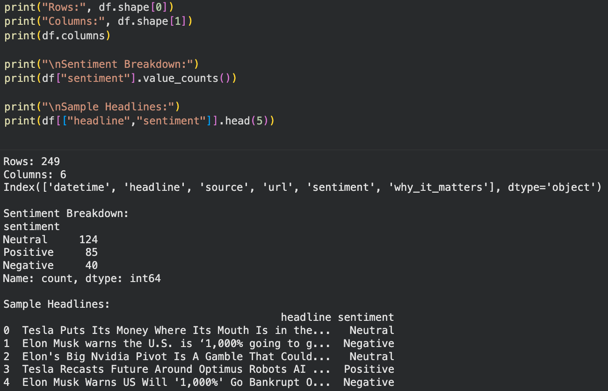

# AI Stock News Briefing

This project generates a simple stock market news briefing for a selected ticker symbol using the Finnhub API.  
It pulls recent headlines, applies sentiment analysis using VADER, and provides a short explanation of why each headline may matter to investors.

## Features
- Pulls the latest stock news headlines for a selected ticker (ex: TSLA, NVDA, AAPL)
- Sentiment classification (Positive / Negative / Neutral)
- Rule-based "Why it matters" explanation
- Outputs a clean stock briefing format

## Tools & Libraries
- Python
- Pandas
- Requests
- Finnhub API
- vaderSentiment

## How to Run
1. Open the notebook file:
   `stock_news_briefing.ipynb`
2. Enter your Finnhub API key when prompted
3. Change the ticker symbol if desired
4. Run all cells to generate the briefing

## Example Output

